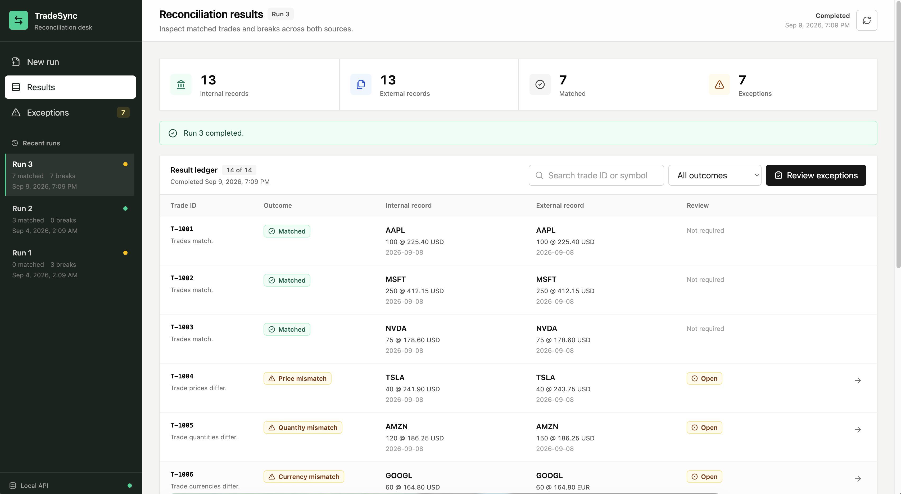
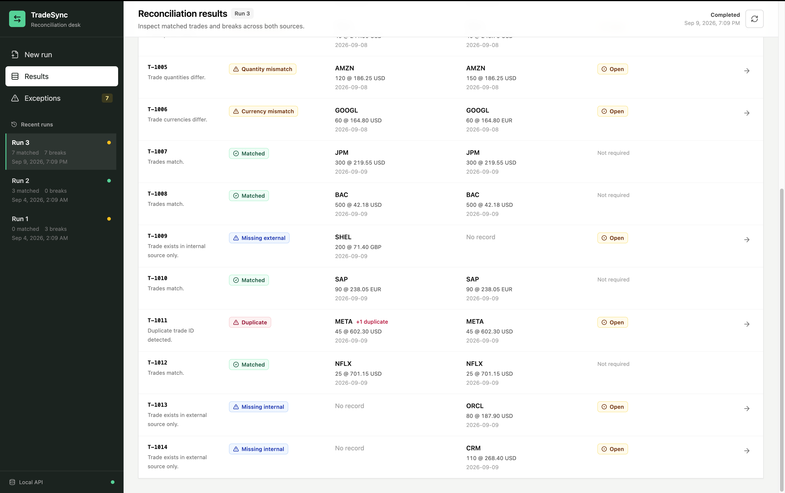

# TradeSync

TradeSync is a local trade-reconciliation and exception-management application.
It compares CSV exports from an internal system and an external broker or
clearing provider, identifies breaks, stores reconciliation history, and lets an
operator resolve or ignore exceptions with an audit note.

## Features

- Upload internal and external trade files through a React interface
- Validate CSV headers and field values before reconciliation
- Match records by trade ID
- Detect missing, duplicate, price, quantity, and currency breaks
- Review run summaries, individual results, and recent run history
- Mark exceptions as resolved or ignored with an audit note
- Persist runs, trades, results, and resolutions in PostgreSQL
- Apply database migrations automatically with Flyway
- Monitor backend availability through a Spring Boot health endpoint

## Technology stack

| Layer                | Technology                                            |
| -------------------- | ----------------------------------------------------- |
| Frontend             | React 19, TypeScript, Vite 6, Tailwind CSS 4          |
| Backend              | Java 21, Spring Boot 3.4, Spring Web, Spring Data JPA |
| Database             | PostgreSQL 16                                         |
| Migrations           | Flyway                                                |
| Build and test       | Maven, npm, JUnit, H2                                 |
| Local infrastructure | Docker Compose                                        |

## Repository layout

```text
tradesync/
├── backend/              Spring Boot API, domain logic, migrations, and tests
├── frontend/             React application and Vite development server
├── sample-data/          Example valid, invalid, and duplicate CSV files
├── docker-compose.yml    Local PostgreSQL service
└── README.md
```

## Prerequisites

Install the following before starting the application:

- Java 21 or newer
- Maven 3.9 or newer
- Node.js and npm
- Docker Desktop, or another running Docker Engine with Compose support

Check the command-line tools:

```bash
java -version
mvn -version
node --version
npm --version
docker --version
docker compose version
```

On macOS or Windows, open Docker Desktop and wait for the engine to finish
starting before running any `docker compose` command.

## Quick start

TradeSync consists of three processes. Start them in this order and keep the
backend and frontend terminals open.

### 1. Start PostgreSQL

From the repository root:

```bash
docker compose up -d
docker compose ps
```

The `postgres` service should show as running. Compose publishes PostgreSQL on
host port `55432`, avoiding the default local PostgreSQL port `5432`.

### 2. Start the backend

In a second terminal:

```bash
cd backend
mvn spring-boot:run
```

Spring Boot connects to PostgreSQL, Flyway applies pending migrations, and the
API starts on `http://localhost:8080`.

Verify it before starting the frontend:

```bash
curl http://localhost:8080/actuator/health
```

Expected response:

```json
{ "status": "UP" }
```

### 3. Start the frontend

In a third terminal:

```bash
cd frontend
npm install
npm run dev
```

Open `http://localhost:5173` and upload one internal CSV and one external CSV.
You can use files from `sample-data/` for a first run.

During development, Vite proxies `/api` and `/actuator` requests to
`http://localhost:8080`. The backend must therefore remain running while the UI
is in use.

## Using the application

1. Open the **Upload** view.
2. Select an internal-source CSV and an external-source CSV.
3. Run the reconciliation.
4. Review the summary and result classifications in **Results**.
5. Open **Exceptions** to inspect a break.
6. Mark the exception `RESOLVED` or `IGNORED` and provide a note.
7. Load an earlier run from the recent-run history when needed.

## CSV input format

Both files must contain the following headers:

```csv
trade_id,symbol,quantity,price,currency,trade_date
```

Example:

```csv
trade_id,symbol,quantity,price,currency,trade_date
T001,AAPL,100,225.40,USD,2026-08-18
T002,MSFT,50,510.25,USD,2026-08-18
```

Validation rules:

- All six headers are required and are case-sensitive.
- Blank lines are ignored, and surrounding field whitespace is trimmed.
- `trade_id` and `symbol` must not be blank.
- `quantity` and `price` must be valid positive decimal values.
- `currency` must be a valid ISO currency code, such as `USD` or `EUR`.
- `trade_date` must use ISO format: `yyyy-MM-dd`.
- Symbol and currency values are normalized to uppercase.
- If either file has validation errors, the run is rejected before
  reconciliation and the API reports the affected rows and fields.

Included examples:

| File                               | Purpose                    |
| ---------------------------------- | -------------------------- |
| `sample-data/valid-trades.csv`     | Valid input records        |
| `sample-data/invalid-trades.csv`   | Field-validation failures  |
| `sample-data/duplicate-trades.csv` | Repeated trade identifiers |

## Reconciliation behavior

Records are grouped and matched by `trade_id`. Each trade ID produces one
result. Rules are evaluated in the following order:

1. More than one internal or external record with the same ID → `DUPLICATE`
2. No matching internal record → `MISSING_INTERNAL`
3. No matching external record → `MISSING_EXTERNAL`
4. Different prices → `PRICE_MISMATCH`
5. Different quantities → `QUANTITY_MISMATCH`
6. Different currencies → `CURRENCY_MISMATCH`
7. Otherwise → `MATCHED`

The current engine validates and stores `symbol` and `trade_date`, but it does
not use those fields as mismatch criteria.

Run lifecycle values are `PENDING`, `PROCESSING`, `COMPLETED`, and `FAILED`.
Exception-resolution values are `OPEN`, `RESOLVED`, and `IGNORED`; the resolve
endpoint accepts only `RESOLVED` or `IGNORED`. A `MATCHED` result cannot be
resolved.

## API reference

| Method  | Endpoint                                  | Description                           |
| ------- | ----------------------------------------- | ------------------------------------- |
| `POST`  | `/api/reconciliations`                    | Upload two CSV files and create a run |
| `GET`   | `/api/reconciliations`                    | List recent runs                      |
| `GET`   | `/api/reconciliations/{runId}`            | Get a run summary                     |
| `GET`   | `/api/reconciliations/{runId}/results`    | Get every result for a run            |
| `GET`   | `/api/reconciliations/{runId}/exceptions` | Get non-matching results for a run    |
| `PATCH` | `/api/exceptions/{resultId}/resolve`      | Add a resolution to an exception      |
| `GET`   | `/actuator/health`                        | Check backend health                  |

### Create a reconciliation

Run this command from the repository root so the sample paths resolve:

```bash
curl -X POST http://localhost:8080/api/reconciliations \
  -F "internalFile=@sample-data/valid-trades.csv" \
  -F "externalFile=@sample-data/duplicate-trades.csv"
```

A successful request returns HTTP `201 Created`, includes the new resource in
the `Location` header, and returns the run summary and results as JSON.

### Query runs and results

```bash
# Recent runs
curl http://localhost:8080/api/reconciliations

# One run
curl http://localhost:8080/api/reconciliations/RUN_ID

# All results for a run
curl http://localhost:8080/api/reconciliations/RUN_ID/results

# Exceptions only
curl http://localhost:8080/api/reconciliations/RUN_ID/exceptions
```

Replace `RUN_ID` with the numeric `runId` returned when a reconciliation is
created.

### Resolve or ignore an exception

```bash
curl -X PATCH http://localhost:8080/api/exceptions/RESULT_ID/resolve \
  -H "Content-Type: application/json" \
  -d '{"resolutionStatus":"RESOLVED","note":"Reviewed against source records."}'
```

Use `IGNORED` instead of `RESOLVED` when appropriate. The note is required,
must not be blank, and is limited to 1,000 characters. Replace `RESULT_ID` with
the numeric `resultId` returned by a results or exceptions endpoint.

### Error responses

API errors use a consistent JSON structure:

```json
{
  "message": "Request validation failed.",
  "errors": [
    {
      "field": "note",
      "message": "must not be blank"
    }
  ]
}
```

Validation failures return HTTP `400`, missing resources return `404`,
unsupported methods return `405`, and unsupported content types return `415`.

## Configuration

The backend reads these environment variables and otherwise uses the local
Compose defaults:

| Variable                | Default                                       |
| ----------------------- | --------------------------------------------- |
| `TRADESYNC_DB_URL`      | `jdbc:postgresql://localhost:55432/tradesync` |
| `TRADESYNC_DB_USERNAME` | `tradesync`                                   |
| `TRADESYNC_DB_PASSWORD` | `tradesync`                                   |

Example using an external database:

```bash
export TRADESYNC_DB_URL='jdbc:postgresql://db.example.com:5432/tradesync'
export TRADESYNC_DB_USERNAME='tradesync_app'
export TRADESYNC_DB_PASSWORD='replace-me'
cd backend
mvn spring-boot:run
```

Flyway migrations live in `backend/src/main/resources/db/migration/`. Hibernate
is configured to validate the migrated schema rather than create it.

## Development commands

### Backend tests

```bash
cd backend
mvn test
```

Tests use an in-memory H2 database and do not require Docker.

### Frontend production build

```bash
cd frontend
npm install
npm run build
```

The build performs TypeScript checks before creating the Vite production bundle
in `frontend/dist/`.

To preview that bundle locally:

```bash
npm run preview
```

## Stopping the application

Stop the frontend and backend with `Ctrl+C` in their respective terminals. Stop
PostgreSQL from the repository root:

```bash
docker compose down
```

The named Docker volume preserves database data between runs. To remove both the
container and all local TradeSync database data, use `docker compose down -v`.
That operation is destructive and cannot restore the deleted volume data.

## Troubleshooting

### `Cannot connect to the Docker daemon`

Docker Desktop or the Docker Engine is not running. Start it, wait until it is
ready, and retry:

```bash
docker compose up -d
docker compose ps
```

### Backend exits with Maven `Process terminated with exit code: 1`

That Maven message is only a summary. Look earlier in the output for the first
`Caused by` message. A common startup failure is:

```text
Unable to obtain connection from database
```

Confirm that PostgreSQL is running and listening on the configured port:

```bash
docker compose ps
docker compose logs postgres
```

Then retry `mvn spring-boot:run`. If you use an external database, verify the
three `TRADESYNC_DB_*` environment variables instead.

### Vite reports `http proxy error` or `ECONNREFUSED`

The frontend is running but Vite cannot reach the backend at port `8080`. Start
the backend and verify it directly:

```bash
curl http://localhost:8080/actuator/health
```

In React development mode, the initial request can appear twice because
`React.StrictMode` intentionally re-runs effects. The duplicate log entry is not
the connection failure; the unavailable backend is.

### Port already in use

Check whether another process owns one of TradeSync's default ports:

```bash
lsof -nP -iTCP:5173 -sTCP:LISTEN
lsof -nP -iTCP:8080 -sTCP:LISTEN
lsof -nP -iTCP:55432 -sTCP:LISTEN
```

Stop the conflicting process or change the relevant Vite, Spring Boot, Docker
Compose, and database connection configuration consistently.

### Database credentials or schema errors

If a pre-existing Docker volume was created with different credentials, changing
the values in `docker-compose.yml` does not update that existing database. Either
restore the original credentials or intentionally recreate the local volume with
`docker compose down -v` followed by `docker compose up -d`. Recreating the
volume permanently deletes the local TradeSync database.



